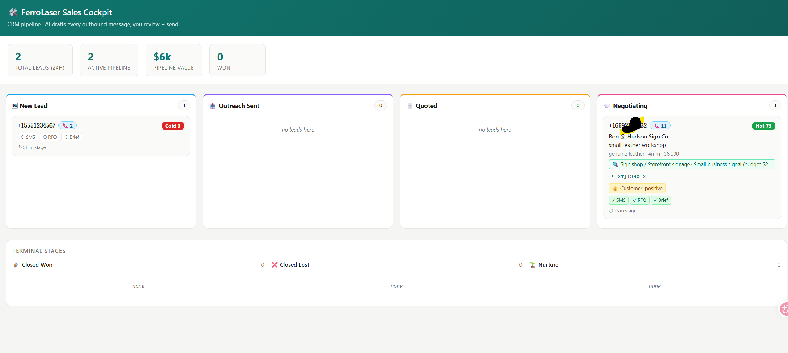

# b2b-call-agent

> 给中国 B2B 外贸制造业的 AI 询盘副驾驶 · An AI inquiry copilot for Chinese B2B export manufacturers

**Open source · MIT License**

电话进来时它替你接，提取需求、生成回复草稿、推进供应链询价 —— 销售只做一件事：审核 AI 的判断并按下"发送"。

When the phone rings while your team's asleep, this app picks up, qualifies the lead, drafts every outbound message (customer SMS, supplier RFQ, internal briefing), and hands a sales rep a ready-to-send packet. The human approves; the AI does the typing.

---

## Screenshots · 截图

**Sales cockpit · 销售仪表盘** — one card per customer, deduped by phone, with AI prep chips + research enrichment inline.



**Customer workspace — brief · 客户工作台（Brief 部分）** — one URL per customer (`/person/+phone`). Inline rename, qualification score, caller research summary, recommended SKU, all on one card.


**Customer workspace — timeline + drafts · 客户工作台（时间轴 + 草稿）** — every call's transcript (with audio when available), every action taken, alongside the AI-drafted SMS / Chinese supplier RFQ / internal briefing waiting for review.


---

- [中文 README](#中文)
- [English README](#english)
- [Contributing · 贡献指南](CONTRIBUTING.md)

---

## 中文

### 这是什么

这是一个**给中国 B2B 外贸制造业**用的开源询盘自动响应系统。

中国出口制造业每天产生海量的海外询盘 —— 一通跨洋电话、一封 RFQ 邮件、一条 LinkedIn 消息都可能是几万到几百万美元的订单。但是真正落到一线销售手里、能在 24 小时内被妥善响应的询盘，比例并不高。

本项目用 **LLM + 电话/SMS + CRM** 把这件事自动化。AI 接电话、问清需求、生成回复草稿、把信息归档进 CRM、跟踪客户的状态变化 —— 销售人员变成 AI 的**副驾驶**：审核 AI 选的产品型号和文案，必要时改一下，按按钮就把消息发给客户、把询价发给工厂的中国团队。

### 这个项目想解决什么痛点

中国出口企业接询盘有三个长期痛点：

1. **时区错位** —— 客户在美国/欧洲/中东打电话来，国内是凌晨。错过的每一通电话都可能是一个被竞争对手抢走的 lead。
2. **英语人才贵** —— 中小工厂请不起足够多、口语足够好的外贸业务员。一个能流利讲英语的销售就是公司的瓶颈。
3. **多语言覆盖更贵** —— 全球询盘可能来自西班牙语、阿拉伯语、葡萄牙语、俄语、德语、日语客户。靠人覆盖所有语种成本高到几乎不可能。

LLM 在这三个点上**结构性占优**：永远在线（解决 #1），英语母语水平（解决 #2），多语言原生（解决 #3）。

### 它怎么工作

```
客户来电 (任意国家、任意时区)
       │
       ▼
  Agent Phone (运营商网关)
       │ webhook
       ▼
  Cloudflare Worker  ─── Gemini 2.5 Flash (~1.5s P50 实时回话)
       │              ─── Supermemory (产品目录语义检索)
       │              ─── Browser Use (来电方公司背景调查)
       ▼
  挂机后流水线
   ├─ 实体抽取 (材料/厚度/预算/Timeline/sentiment/buyer persona/Concerns)
   ├─ 推荐型号 + 推荐理由
   ├─ 3 份草稿:  💬 客户 SMS         (英文回复)
   │             🇨🇳 供应链 RFQ      (中文询价单)
   │             📋 内部 briefing    (给销售看的速读包)
   ├─ Workers KV (call_id → CallRecord, lead:<phone> → LeadIndex)
   ├─ Airtable (永久留档)
   └─ Slack (#hackathon-calls 主通知 + #sourcing-china 供应链通道)
       │
       ▼
  销售打开 /person/<phone> (一个客户一个页面)
   ├─ Brief 卡: 客户/公司/资质评分/推荐型号/背调摘要/风险点
   ├─ 历史时间轴: 这通+历史所有通话录音+transcript + 发出的 SMS/RFQ/动作
   ├─ Actions 列: 改名 / 启动背调 / 3 份草稿 (审核+发送) / 阶段推进
   │
   ▼
  外部系统集成
   ├─ REST API     /api/v1/*   (X-API-Key 鉴权, JSON in/out)
   └─ MCP Server   /mcp        (Streamable HTTP, JSON-RPC 2.0)
                                给 AI agent (Claude Desktop/Cursor) 直接接管
```

### 销售工作流程

CRM 阶段是按制造业 B2B 习惯做的：

```
[ new_lead ]         AI 已合格化, 销售还没发任何外联
   ↓ 3 个外联动作 (SMS / RFQ / Brief) 都完成
[ outreach_sent ]    SMS + RFQ + briefing 都发了, 等客户和工厂反馈
   ↓ 工厂确认报价
[ quoted ]           正式报价发给客户
   ↓ 客户回应
[ negotiating ]      客户已经在和你谈, 进入收尾博弈
   ↓
[ closed_won ]   [ closed_lost ]   [ nurture (暂缓再跟进) ]
```

每个阶段销售只需要审核 AI 做出的判断（型号选对了吗？回复文案行不行？要不要调整？），不需要从零起草。

### 技术栈

| 层 | 技术 | 说明 |
|---|---|---|
| 边缘运行时 | Cloudflare Workers + Hono | 全球边缘部署, 冷启动近 0 |
| 存储 | Workers KV | call_id 24h TTL, lead:phone 7d TTL |
| LLM | Google Gemini 2.5 Flash | JSON 模式, `thinkingBudget: 0`, 256 tokens, P95 < 2.8s |
| 语义检索 | Supermemory v3 | 产品目录 ~300ms 语义匹配, 每次通话给 Gemini 做检索增强 |
| 浏览器 agent | Browser Use Cloud v3 | 自动上网查来电方公司背景, ~$0.10/次 |
| 电话/SMS | Agent Phone | 接电话、回 SMS、录音 |
| CRM | Airtable | 永久存档+人类可读 |
| 通知 | Slack | 询盘到达 + 工厂询价 |
| API/MCP | 自写 | REST `/api/v1/*` + MCP `/mcp` (JSON-RPC 2.0) |
| 类型 | TypeScript strict | `noEmit` 编译检查, 全文零类型错误 |

### 商业模式参照

这套东西可以做成**标准 SaaS**：

- 每家企业自带产品知识库 (用 Supermemory container_tag 隔离)
- 每家企业自己的电话号码 (Agent Phone 多号支持)
- 每家企业自己的 CRM (Airtable workspace 隔离 / 也可以接 HubSpot)

询盘的价值有清晰的市场定价 —— **CPL (Cost Per Lead)** 是营销领域的标准指标。一个询盘电话在大多数 B2B 行业的 CPL 是几百到上千人民币不等。本项目把"每个询盘的处理成本"压到接近零，**回收 CPL 的边际增量 = 直接的商业价值**。

中国出口制造业有数万家有真实询盘的 B2B 公司 —— 标准化的 SaaS 是有市场支撑的。

### 快速开始 (本地开发)

```bash
# 1. clone + 装依赖
git clone https://github.com/jinweihan-ai/b2b_call_agent.git
cd b2b_call_agent
npm install

# 2. 配置环境变量
cp .dev.vars.example .dev.vars
# 编辑 .dev.vars 填入你的 key (见下表)

# 3. 起本地 worker
npx wrangler dev

# 4. (可选) 用 ngrok 暴露给 Agent Phone webhook 用
ngrok http 8787
# 把 ngrok 给的 https URL 填到 Agent Phone 控制台的 webhook 配置里
```

### 需要的环境变量

| 变量 | 用途 | 必需? |
|---|---|---|
| `AIRTABLE_TOKEN` | Airtable PAT | 是 |
| `AIRTABLE_BASE_ID` | Airtable base id | 是 |
| `AIRTABLE_TABLE_NAME` | 表名 (默认 `Calls`) | 是 |
| `SLACK_WEBHOOK_URL` | 主 Slack 通知通道 | 是 |
| `SOURCING_WEBHOOK_URL` | 供应链询价专用通道 | 否, 缺则回落到主通道带前缀 |
| `AGENT_PHONE_API_KEY` | Agent Phone API key, 用于发 SMS + 拉录音 | 是 |
| `AGENT_PHONE_API_BASE` | 默认 `https://api.agentphone.ai/v1` | 否 |
| `AGENT_PHONE_SIGNING_SECRET` | webhook HMAC 验证用 | 否 (建议生产开) |
| `GEMINI_API_KEY` | Google AI Studio key | 是 |
| `SUPERMEMORY_API_KEY` | Supermemory v3 key | 是 |
| `BROWSER_USE_API_KEY` | Browser Use Cloud key (`bu_...`) | 否, 缺则关闭背调 |
| `API_KEY` | REST API + MCP 共享鉴权密钥 | 是 (对外暴露时) |

### 给下游系统的接口

#### REST API (给 OA / 营销 / KOL / 社媒平台 / CRM 联动用)

所有请求带 `X-API-Key: <API_KEY>` header. JSON in/out.

```bash
# 查所有客户
curl -H "X-API-Key: $KEY" https://<your-domain>/api/v1/persons

# 查单个客户详情
curl -H "X-API-Key: $KEY" https://<your-domain>/api/v1/persons/+16692120332

# 改名 (sales 给客户起一个易记的名字)
curl -X POST -H "X-API-Key: $KEY" -H "Content-Type: application/json" \
  -d '{"display_name":"Ron @ Hudson Sign Co"}' \
  https://<your-domain>/api/v1/persons/+16692120332/rename

# 启动背调
curl -X POST -H "X-API-Key: $KEY" \
  https://<your-domain>/api/v1/persons/+16692120332/research

# 自动发现：列出所有端点
curl https://<your-domain>/api/v1
```

完整端点列表见 `GET /api/v1` 的自动发现响应。

#### MCP Server (给 AI agent 用, 如 Claude Desktop / Cursor / 自研 agent)

Streamable HTTP transport, JSON-RPC 2.0, 单一 `POST /mcp` 端点.

客户端配置示例 (Claude Desktop / Cursor 风格)：

```json
{
  "mcpServers": {
    "b2b-call-agent": {
      "url": "https://<your-domain>/mcp",
      "headers": { "X-API-Key": "<your-api-key>" }
    }
  }
}
```

暴露的 15 个 tools：

| Tool | 用途 |
|---|---|
| `list_persons` / `get_person` | 客户列表 / 详情 |
| `rename_person` | 改名 |
| `start_research` | 启动 Browser Use 背调 |
| `list_calls` / `get_call` | 通话列表 / 详情 |
| `send_sms` / `send_rfq` | 发客户 SMS / 发供应链询价 |
| `ack_briefing` | 标记 briefing 已读 |
| `move_to_quoted` / `move_to_negotiating` / `close_deal` | 阶段推进 |
| `list_products` / `search_products` | 产品目录 / 语义搜索 |
| `reindex_leads` | 重建索引 |

3 个静态资源 + 2 个模板资源：

- `catalog://products`, `persons://all`, `calls://all`
- `person://{phone}`, `call://{call_id}`

### 项目结构

```
src/
├── index.ts                    # Hono 路由总入口
├── types.ts                    # Bindings (env vars + KV namespace)
├── handlers/
│   ├── voice-reply.ts          # 实时对话: Gemini JSON 模式, stall guard, FSM 回落
│   ├── call-end.ts             # 挂机流水线: KV + Airtable + Slack + 抽取 + 草稿生成
│   ├── replay.ts               # 单通话页 (legacy alias, 自动 302 → /person/<phone>)
│   ├── person.ts               # /person/:phone 客户工作台
│   ├── dashboard.ts            # / 主仪表盘 (一个客户一张卡)
│   ├── actions.ts              # 表单 POST 处理 (UI 用)
│   ├── admin.ts                # 索引回填等管理端
│   ├── api.ts                  # REST API /api/v1/*
│   └── mcp.ts                  # MCP server /mcp
├── lib/
│   ├── render.ts               # HTML 渲染 (brief + timeline + actions)
│   ├── leads.ts                # 客户索引层 (phone → calls[] + research + display_name)
│   ├── call-io.ts              # 共享的 call 读写 + state 转换 + Agent Phone SMS
│   ├── services.ts             # 业务逻辑 service 层 (REST + MCP 共用)
│   ├── airtable.ts             # Airtable 写入
│   ├── slack.ts                # Slack webhook
│   ├── extract-gemini.ts       # Gemini 实体抽取 (含 caller_name/company)
│   ├── extract.ts              # 老的 regex 抽取 (回落)
│   ├── drafts-gemini.ts        # 3 份草稿生成
│   ├── supermemory.ts          # 产品语义检索
│   ├── browser-use.ts          # Browser Use Cloud v3 wrapper
│   └── gemini.ts               # JSON 模式 generateContent 包装
└── data/
    └── products.json           # 演示用产品目录 (FerroLaser 15 SKU)
```

### 路线图

短期：
- [ ] 多语言: 当前只覆盖英文来电方, 接下来加西班牙语/阿拉伯语/葡萄牙语
- [ ] Webhook 订阅: 让下游系统订阅 `call.received` / `lead.research_done` / `call.outcome` 事件
- [ ] Pagination + cursor (REST 当前 list 是一把抓 200)
- [ ] OpenAPI 3 spec 自动生成 (让下游 SDK 自动生成)
- [ ] 自动 re-extract 端点 (给老的 call 补 caller_name / company)

中期：
- [ ] 多租户隔离 (按 workspace_id 分离每家企业的数据)
- [ ] 自定义产品知识库 UI (上传 / 训练 / 测试)
- [ ] HubSpot / Salesforce / 飞书 OA 双向同步
- [ ] 主动外呼 / 定时回拨

长期：
- [ ] 询盘归因 + ROI 报表 (CPL 指标对齐)
- [ ] Agentic follow-up (AI 自主在邮件/SMS/社媒之间切换通道跟进)

### 贡献

欢迎 PR。代码风格：
- TypeScript strict
- 单文件 < 1500 行 (实在大可以再拆)
- 不重复造抽象 (3 个相似行优于一个早熟的抽象)
- 错误处理只在边界 (外部 API / 用户输入)，内部信任

### 致谢

本项目最初是为 **YC Hackathon 2026 "call my agent"** 赛道写的原型。感谢：
- **Google DeepMind** 提供 Gemini API credit
- **Supermemory** 提供存储 + 语义检索
- **Browser Use** 提供 cloud agent credit (\$100)
- **Agent Phone** 提供电话网关 + 录音

Demo 用的产品目录 (FerroLaser 激光切割机) 是真实公开数据，从 [ferrolaser.com](https://ferrolaser.com) 通过 Browser Use 抓的。本项目本身和 FerroLaser 没有商业关系，仅作为演示样本。

### 许可

[MIT License](LICENSE) —— 你可以自由商用、改造、私有部署。鼓励改成自己工厂或服务商的 SaaS 上线。

---

## English

### What is this

An open-source **inquiry-response automation system** built for **Chinese B2B export manufacturers**.

Chinese export manufacturing generates a massive volume of overseas inquiries every day — a transpacific phone call, an RFQ email, a LinkedIn message can each be worth $10k-$1M in orders. But the fraction of inquiries that actually reach a frontline salesperson and get a competent response within 24 hours is uncomfortably low.

This project uses **LLM + telephony/SMS + CRM** to automate that. The AI picks up the phone, qualifies the inquiry, drafts every outbound message, files everything into a CRM, and tracks the customer through your sales pipeline. The human salesperson becomes the **AI's copilot**: review what the AI picked, edit if needed, click send.

### The pain it solves

Chinese export companies share three structural pain points when handling overseas inquiries:

1. **Timezone mismatch** — buyers in the US / EU / Middle East call when China is asleep. Every missed call is a lead a competitor will pick up.
2. **English-fluent salespeople are expensive** — small and mid-size factories can't afford to hire enough native-level English speakers. A single bilingual rep becomes a corporate bottleneck.
3. **Multi-language coverage is even more expensive** — global buyers speak Spanish, Arabic, Portuguese, Russian, German, Japanese, etc. Covering all of them with humans is prohibitive.

LLMs are **structurally better than humans** on all three axes: always-on (#1), native-level English (#2), natively multilingual (#3).

### How it works

```
Inbound call (any country, any timezone)
       │
       ▼
  Agent Phone  (telephony carrier gateway)
       │ webhook
       ▼
  Cloudflare Worker  ─── Gemini 2.5 Flash   (~1.5s P50 in-call replies)
       │              ─── Supermemory       (semantic product catalog search)
       │              ─── Browser Use       (background research on caller's company)
       ▼
  Post-call pipeline
   ├─ Entity extraction (material, thickness, budget, timeline, sentiment, persona, concerns)
   ├─ Recommended SKU + reasoning
   ├─ 3 drafts:  💬 Customer SMS         (in caller's language)
   │            🇨🇳 Supplier RFQ          (Chinese to your factory team)
   │            📋 Internal briefing      (TL;DR for the human rep)
   ├─ Workers KV (call_id → CallRecord, lead:<phone> → LeadIndex)
   ├─ Airtable (permanent archive)
   └─ Slack (#hackathon-calls + #sourcing-china)
       │
       ▼
  Sales opens /person/<phone>  (one customer = one URL)
   ├─ Brief card: caller, qualification, recommended SKU, research, concerns
   ├─ Timeline:    this call + every prior call (transcript + audio inline) + actions
   ├─ Actions:     rename / research / 3 drafts (approve+send) / pipeline transitions
   │
   ▼
  External integrations
   ├─ REST API     /api/v1/*   (X-API-Key auth, JSON in/out)
   └─ MCP Server   /mcp        (Streamable HTTP, JSON-RPC 2.0)
                                For AI agents (Claude Desktop, Cursor, in-house)
```

### Sales workflow

The CRM pipeline matches B2B manufacturing convention:

```
[ new_lead ]         AI qualified; rep hasn't sent any outreach
   ↓ 3 outreach actions (SMS / RFQ / Brief) all complete
[ outreach_sent ]    SMS + RFQ + briefing all sent; awaiting customer + factory
   ↓ factory confirms pricing
[ quoted ]           formal quote sent to customer
   ↓ customer engages
[ negotiating ]      active back-and-forth
   ↓
[ closed_won ]   [ closed_lost ]   [ nurture (re-engage later) ]
```

At each stage the rep only **reviews** AI decisions (right SKU? acceptable copy? need a tweak?) — never drafts from scratch.

### Tech stack

| Layer | Tech | Notes |
|---|---|---|
| Edge runtime | Cloudflare Workers + Hono | Globally deployed, ~0 cold start |
| Storage | Workers KV | call_id 24h TTL, lead:phone 7d TTL |
| LLM | Google Gemini 2.5 Flash | JSON mode, `thinkingBudget: 0`, 256 tokens, P95 < 2.8s |
| Semantic search | Supermemory v3 | ~300ms product catalog matching, grounding for every Gemini call |
| Browser agent | Browser Use Cloud v3 | Caller company research, ~$0.10/run |
| Telephony/SMS | Agent Phone | Inbound voice, outbound SMS, recordings |
| CRM persistence | Airtable | Permanent + human-readable |
| Notifications | Slack | Inbound calls + sourcing alerts |
| API / MCP | Hand-rolled | REST `/api/v1/*` + MCP `/mcp` (JSON-RPC 2.0) |
| Types | TypeScript strict | `noEmit` checked, zero type errors |

### Business model

This is designed to ship as a **standard SaaS**:

- Each tenant brings their own product knowledge base (isolated via Supermemory `container_tag`)
- Each tenant gets their own phone number (Agent Phone supports multi-number)
- Each tenant uses their own CRM (Airtable workspace isolation, or plug into HubSpot)

Inquiry value has a clean market price — **CPL (Cost Per Lead)** is the standard marketing metric. A single B2B inquiry call costs anywhere from a few hundred RMB to several thousand. This project drops the per-inquiry handling cost to near-zero. The **margin recaptured from CPL = direct business value**.

China has tens of thousands of B2B export companies with real inquiry volume — the standard-SaaS approach has clear market support.

### Quick start (local dev)

```bash
# 1. clone + install deps
git clone https://github.com/jinweihan-ai/b2b_call_agent.git
cd b2b_call_agent
npm install

# 2. configure env vars
cp .dev.vars.example .dev.vars
# Edit .dev.vars with your keys (see env table)

# 3. start the worker locally
npx wrangler dev

# 4. (optional) expose to Agent Phone via ngrok
ngrok http 8787
# Paste the https URL into Agent Phone's webhook config
```

### Required env vars

| Variable | Purpose | Required? |
|---|---|---|
| `AIRTABLE_TOKEN` | Airtable PAT | Yes |
| `AIRTABLE_BASE_ID` | Airtable base id | Yes |
| `AIRTABLE_TABLE_NAME` | Table name (default `Calls`) | Yes |
| `SLACK_WEBHOOK_URL` | Primary Slack channel | Yes |
| `SOURCING_WEBHOOK_URL` | Dedicated sourcing channel | No, falls back to primary |
| `AGENT_PHONE_API_KEY` | Agent Phone key (SMS + recording fetch) | Yes |
| `AGENT_PHONE_API_BASE` | Default `https://api.agentphone.ai/v1` | No |
| `AGENT_PHONE_SIGNING_SECRET` | Webhook HMAC verification | Optional (recommended for prod) |
| `GEMINI_API_KEY` | Google AI Studio key | Yes |
| `SUPERMEMORY_API_KEY` | Supermemory v3 key | Yes |
| `BROWSER_USE_API_KEY` | Browser Use Cloud key (`bu_...`) | No, disables research if missing |
| `API_KEY` | Shared secret for REST + MCP auth | Yes (when exposed externally) |

### Downstream integration

#### REST API (for OA / marketing / KOL / social platforms / CRM sync)

All requests carry `X-API-Key: <API_KEY>`. JSON in/out.

```bash
# List all customers
curl -H "X-API-Key: $KEY" https://<your-domain>/api/v1/persons

# Get one customer
curl -H "X-API-Key: $KEY" https://<your-domain>/api/v1/persons/+16692120332

# Rename
curl -X POST -H "X-API-Key: $KEY" -H "Content-Type: application/json" \
  -d '{"display_name":"Ron @ Hudson Sign Co"}' \
  https://<your-domain>/api/v1/persons/+16692120332/rename

# Trigger background research
curl -X POST -H "X-API-Key: $KEY" \
  https://<your-domain>/api/v1/persons/+16692120332/research

# Self-discovery: list every endpoint
curl https://<your-domain>/api/v1
```

#### MCP Server (for AI agents — Claude Desktop, Cursor, in-house)

Streamable HTTP transport, JSON-RPC 2.0, single `POST /mcp` endpoint.

Client config example:

```json
{
  "mcpServers": {
    "b2b-call-agent": {
      "url": "https://<your-domain>/mcp",
      "headers": { "X-API-Key": "<your-api-key>" }
    }
  }
}
```

15 tools exposed, mapping 1:1 to the REST endpoints. 3 static resources + 2 templates:

- Static: `catalog://products`, `persons://all`, `calls://all`
- Templates: `person://{phone}`, `call://{call_id}`

### Repository layout

```
src/
├── index.ts                    # Hono router entry
├── types.ts                    # Bindings (env vars + KV namespace)
├── handlers/
│   ├── voice-reply.ts          # In-call replies: Gemini JSON, stall guard, FSM fallback
│   ├── call-end.ts             # Post-call pipeline: KV + Airtable + Slack + extraction + drafts
│   ├── replay.ts               # Single-call page (legacy alias, 302 → /person/<phone>)
│   ├── person.ts               # /person/:phone customer workspace
│   ├── dashboard.ts            # / cockpit (one card per customer)
│   ├── actions.ts              # Form POST handlers (UI)
│   ├── admin.ts                # Index reindex etc.
│   ├── api.ts                  # REST API at /api/v1/*
│   └── mcp.ts                  # MCP server at /mcp
├── lib/
│   ├── render.ts               # HTML rendering (brief + timeline + actions)
│   ├── leads.ts                # Customer index (phone → calls[] + research + display_name)
│   ├── call-io.ts              # Shared call IO + state + Agent Phone SMS
│   ├── services.ts             # Business logic service layer (REST + MCP share)
│   ├── airtable.ts             # Airtable writer
│   ├── slack.ts                # Slack webhook
│   ├── extract-gemini.ts       # Gemini entity extraction
│   ├── extract.ts              # Legacy regex extractor (fallback)
│   ├── drafts-gemini.ts        # 3-draft generator
│   ├── supermemory.ts          # Product semantic search
│   ├── browser-use.ts          # Browser Use Cloud v3 wrapper
│   └── gemini.ts               # JSON-mode generateContent wrapper
└── data/
    └── products.json           # Demo product catalog (FerroLaser 15 SKUs)
```

### Roadmap

Short term:
- [ ] Multi-language: today only English callers; add Spanish, Arabic, Portuguese next
- [ ] Webhook subscriptions: let downstream systems subscribe to `call.received` / `lead.research_done` / `call.outcome` events
- [ ] Pagination + cursors (REST list endpoints currently fetch up to 200 in one shot)
- [ ] OpenAPI 3 spec generation (for downstream SDK autogen)
- [ ] Re-extract endpoint (backfill caller_name / company on legacy calls)

Mid term:
- [ ] Multi-tenant isolation (workspace_id scoping)
- [ ] Knowledge-base UI (upload / train / test custom product catalogs)
- [ ] Two-way sync with HubSpot / Salesforce / Feishu OA
- [ ] Proactive outbound calls / scheduled callbacks

Long term:
- [ ] Inquiry attribution + ROI reporting (CPL alignment)
- [ ] Agentic follow-up (AI autonomously switching across email / SMS / social to nurture leads)

### Contributing

PRs welcome. Code style:
- TypeScript strict
- Single file < 1500 lines (split if it grows past)
- No premature abstraction (three similar lines beat one early abstraction)
- Error handling only at boundaries (external APIs, user input); trust internal calls

### Acknowledgements

Built as a prototype for the **YC Hackathon 2026 "call my agent"** track. Thanks to:
- **Google DeepMind** for Gemini API credits
- **Supermemory** for storage + semantic search
- **Browser Use** for cloud agent credits (\$100)
- **Agent Phone** for telephony + recording

The demo catalog (FerroLaser laser cutters) is real public data scraped from [ferrolaser.com](https://ferrolaser.com) via Browser Use. The project has no commercial relationship with FerroLaser — they're just a representative sample.

### License

[MIT License](LICENSE) — free for commercial use, fork, private deployment. Encouraged: turn this into a SaaS for your factory or your customers.
