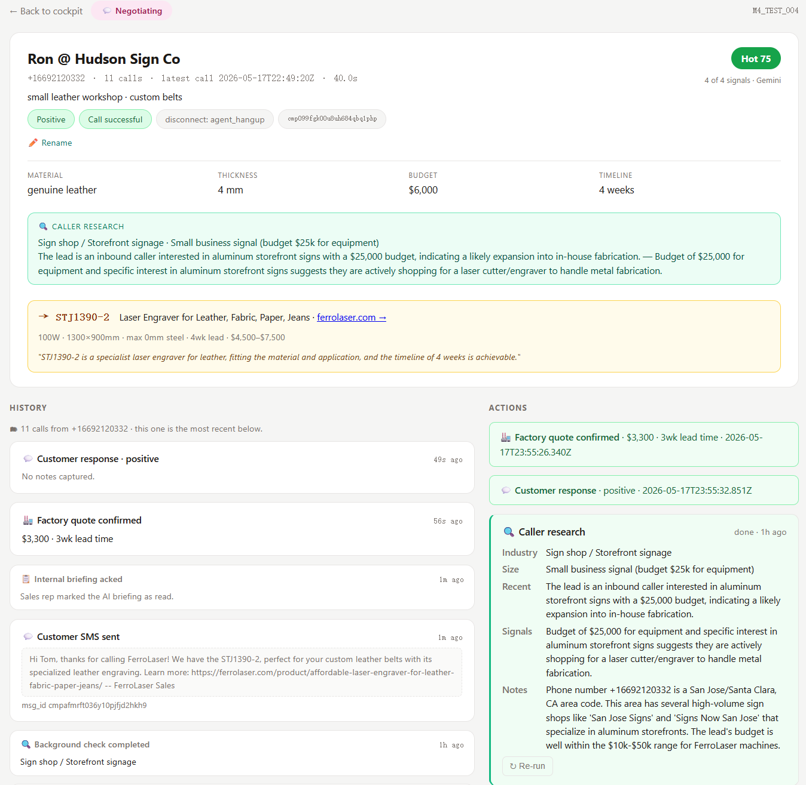
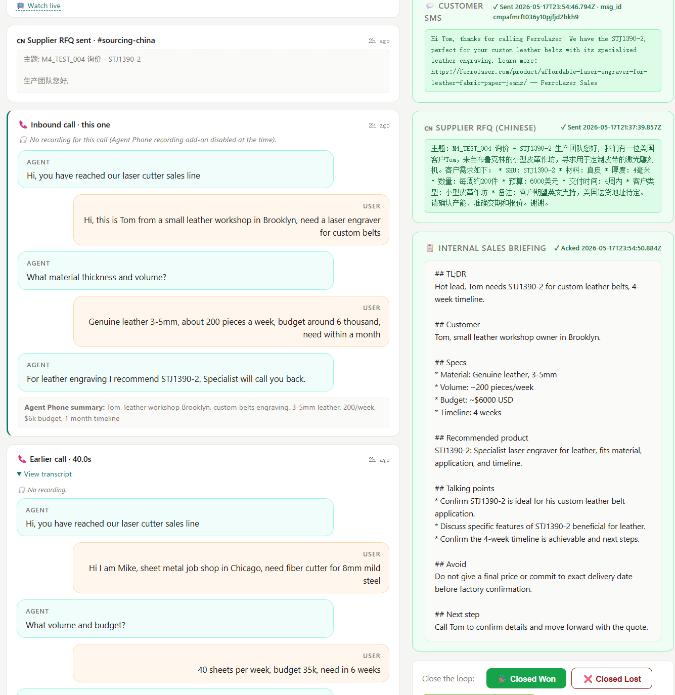

# b2b-call-agent

> An AI inquiry copilot for Chinese B2B export manufacturers — picks up the phone when your team's asleep, qualifies the lead, drafts every outbound message, hands a sales rep a ready-to-send packet.

> 🌐 **English** · [中文](README.zh-CN.md)

**Open source · MIT License**

---

## Screenshots

**Sales cockpit** — one card per customer, deduped by phone, with AI prep chips + research enrichment inline.


**Customer workspace — brief** — one URL per customer (`/person/+phone`). Inline rename, qualification score, caller research summary, recommended SKU, all on one card.



**Customer workspace — timeline + drafts** — every call's transcript (with audio when available), every action taken, alongside the AI-drafted SMS / Chinese supplier RFQ / internal briefing waiting for review.



---

## What is this

An open-source **inquiry-response automation system** built for **Chinese B2B export manufacturers**.

Chinese export manufacturing generates a massive volume of overseas inquiries every day — a transpacific phone call, an RFQ email, a LinkedIn message can each be worth $10k-$1M in orders. But the fraction of inquiries that actually reach a frontline salesperson and get a competent response within 24 hours is uncomfortably low.

This project uses **LLM + telephony/SMS + CRM** to automate that. The AI picks up the phone, qualifies the inquiry, drafts every outbound message, files everything into a CRM, and tracks the customer through your sales pipeline. The human salesperson becomes the **AI's copilot**: review what the AI picked, edit if needed, click send.

## The pain it solves

Chinese export companies share three structural pain points when handling overseas inquiries:

1. **Timezone mismatch** — buyers in the US / EU / Middle East call when China is asleep. Every missed call is a lead a competitor will pick up.
2. **English-fluent salespeople are expensive** — small and mid-size factories can't afford to hire enough native-level English speakers. A single bilingual rep becomes a corporate bottleneck.
3. **Multi-language coverage is even more expensive** — global buyers speak Spanish, Arabic, Portuguese, Russian, German, Japanese, etc. Covering all of them with humans is prohibitive.

LLMs are **structurally better than humans** on all three axes: always-on (#1), native-level English (#2), natively multilingual (#3).

## How it works

```
Inbound call (any country, any timezone)
       │
       ▼
  Agent Phone  (telephony carrier gateway)
       │ webhook
       ▼
  Cloudflare Worker  ─── Gemini 2.5 Flash   (~1.5s P50 in-call replies)
       │              ─── Supermemory       (semantic product catalog search)
       │              ─── Browser Use       (background research on caller's company)
       ▼
  Post-call pipeline
   ├─ Entity extraction (material, thickness, budget, timeline, sentiment, persona, concerns)
   ├─ Recommended SKU + reasoning
   ├─ 3 drafts:  💬 Customer SMS         (in caller's language)
   │            🇨🇳 Supplier RFQ          (Chinese to your factory team)
   │            📋 Internal briefing      (TL;DR for the human rep)
   ├─ Workers KV (call_id → CallRecord, lead:<phone> → LeadIndex)
   ├─ Airtable (permanent archive)
   └─ Slack (#hackathon-calls + #sourcing-china)
       │
       ▼
  Sales opens /person/<phone>  (one customer = one URL)
   ├─ Brief card: caller, qualification, recommended SKU, research, concerns
   ├─ Timeline:    this call + every prior call (transcript + audio inline) + actions
   ├─ Actions:     rename / research / 3 drafts (approve+send) / pipeline transitions
   │
   ▼
  External integrations
   ├─ REST API     /api/v1/*   (X-API-Key auth, JSON in/out)
   └─ MCP Server   /mcp        (Streamable HTTP, JSON-RPC 2.0)
                                For AI agents (Claude Desktop, Cursor, in-house)
```

## Sales workflow

The CRM pipeline matches B2B manufacturing convention:

```
[ new_lead ]         AI qualified; rep hasn't sent any outreach
   ↓ 3 outreach actions (SMS / RFQ / Brief) all complete
[ outreach_sent ]    SMS + RFQ + briefing all sent; awaiting customer + factory
   ↓ factory confirms pricing
[ quoted ]           formal quote sent to customer
   ↓ customer engages
[ negotiating ]      active back-and-forth
   ↓
[ closed_won ]   [ closed_lost ]   [ nurture (re-engage later) ]
```

At each stage the rep only **reviews** AI decisions (right SKU? acceptable copy? need a tweak?) — never drafts from scratch.

## Tech stack

| Layer | Tech | Notes |
|---|---|---|
| Edge runtime | Cloudflare Workers + Hono | Globally deployed, ~0 cold start |
| Storage | Workers KV | call_id 24h TTL, lead:phone 7d TTL |
| LLM | Google Gemini 2.5 Flash | JSON mode, `thinkingBudget: 0`, 256 tokens, P95 < 2.8s |
| Semantic search | Supermemory v3 | ~300ms product catalog matching, grounding for every Gemini call |
| Browser agent | Browser Use Cloud v3 | Caller company research, ~$0.10/run |
| Telephony/SMS | Agent Phone | Inbound voice, outbound SMS, recordings |
| CRM persistence | Airtable | Permanent + human-readable |
| Notifications | Slack | Inbound calls + sourcing alerts |
| API / MCP | Hand-rolled | REST `/api/v1/*` + MCP `/mcp` (JSON-RPC 2.0) |
| Types | TypeScript strict | `noEmit` checked, zero type errors |

## Business model

This is designed to ship as a **standard SaaS**:

- Each tenant brings their own product knowledge base (isolated via Supermemory `container_tag`)
- Each tenant gets their own phone number (Agent Phone supports multi-number)
- Each tenant uses their own CRM (Airtable workspace isolation, or plug into HubSpot)

Inquiry value has a clean market price — **CPL (Cost Per Lead)** is the standard marketing metric. A single B2B inquiry call costs anywhere from a few hundred RMB to several thousand. This project drops the per-inquiry handling cost to near-zero. The **margin recaptured from CPL = direct business value**.

China has tens of thousands of B2B export companies with real inquiry volume — the standard-SaaS approach has clear market support.

## Quick start (local dev)

```bash
# 1. clone + install deps
git clone https://github.com/jinweihan-ai/b2b_call_agent.git
cd b2b_call_agent
npm install

# 2. configure env vars
cp .dev.vars.example .dev.vars
# Edit .dev.vars with your keys (see env table)

# 3. start the worker locally
npx wrangler dev

# 4. (optional) expose to Agent Phone via ngrok
ngrok http 8787
# Paste the https URL into Agent Phone's webhook config
```

## Required env vars

| Variable | Purpose | Required? |
|---|---|---|
| `AIRTABLE_TOKEN` | Airtable PAT | Yes |
| `AIRTABLE_BASE_ID` | Airtable base id | Yes |
| `AIRTABLE_TABLE_NAME` | Table name (default `Calls`) | Yes |
| `SLACK_WEBHOOK_URL` | Primary Slack channel | Yes |
| `SOURCING_WEBHOOK_URL` | Dedicated sourcing channel | No, falls back to primary |
| `AGENT_PHONE_API_KEY` | Agent Phone key (SMS + recording fetch) | Yes |
| `AGENT_PHONE_API_BASE` | Default `https://api.agentphone.ai/v1` | No |
| `AGENT_PHONE_SIGNING_SECRET` | Webhook HMAC verification | Optional (recommended for prod) |
| `GEMINI_API_KEY` | Google AI Studio key | Yes |
| `SUPERMEMORY_API_KEY` | Supermemory v3 key | Yes |
| `BROWSER_USE_API_KEY` | Browser Use Cloud key (`bu_...`) | No, disables research if missing |
| `API_KEY` | Shared secret for REST + MCP auth | Yes (when exposed externally) |

## Downstream integration

### REST API (for OA / marketing / KOL / social platforms / CRM sync)

All requests carry `X-API-Key: <API_KEY>`. JSON in/out.

```bash
# List all customers
curl -H "X-API-Key: $KEY" https://<your-domain>/api/v1/persons

# Get one customer
curl -H "X-API-Key: $KEY" https://<your-domain>/api/v1/persons/+16692120332

# Rename
curl -X POST -H "X-API-Key: $KEY" -H "Content-Type: application/json" \
  -d '{"display_name":"Ron @ Hudson Sign Co"}' \
  https://<your-domain>/api/v1/persons/+16692120332/rename

# Trigger background research
curl -X POST -H "X-API-Key: $KEY" \
  https://<your-domain>/api/v1/persons/+16692120332/research

# Self-discovery: list every endpoint
curl https://<your-domain>/api/v1
```

### MCP Server (for AI agents — Claude Desktop, Cursor, in-house)

Streamable HTTP transport, JSON-RPC 2.0, single `POST /mcp` endpoint.

Client config example:

```json
{
  "mcpServers": {
    "b2b-call-agent": {
      "url": "https://<your-domain>/mcp",
      "headers": { "X-API-Key": "<your-api-key>" }
    }
  }
}
```

15 tools exposed, mapping 1:1 to the REST endpoints. 3 static resources + 2 templates:

- Static: `catalog://products`, `persons://all`, `calls://all`
- Templates: `person://{phone}`, `call://{call_id}`

## Repository layout

```
src/
├── index.ts                    # Hono router entry
├── types.ts                    # Bindings (env vars + KV namespace)
├── handlers/
│   ├── voice-reply.ts          # In-call replies: Gemini JSON, stall guard, FSM fallback
│   ├── call-end.ts             # Post-call pipeline: KV + Airtable + Slack + extraction + drafts
│   ├── replay.ts               # Single-call page (legacy alias, 302 → /person/<phone>)
│   ├── person.ts               # /person/:phone customer workspace
│   ├── dashboard.ts            # / cockpit (one card per customer)
│   ├── actions.ts              # Form POST handlers (UI)
│   ├── admin.ts                # Index reindex etc.
│   ├── api.ts                  # REST API at /api/v1/*
│   └── mcp.ts                  # MCP server at /mcp
├── lib/
│   ├── render.ts               # HTML rendering (brief + timeline + actions)
│   ├── leads.ts                # Customer index (phone → calls[] + research + display_name)
│   ├── call-io.ts              # Shared call IO + state + Agent Phone SMS
│   ├── services.ts             # Business logic service layer (REST + MCP share)
│   ├── airtable.ts             # Airtable writer
│   ├── slack.ts                # Slack webhook
│   ├── extract-gemini.ts       # Gemini entity extraction
│   ├── extract.ts              # Legacy regex extractor (fallback)
│   ├── drafts-gemini.ts        # 3-draft generator
│   ├── supermemory.ts          # Product semantic search
│   ├── browser-use.ts          # Browser Use Cloud v3 wrapper
│   └── gemini.ts               # JSON-mode generateContent wrapper
└── data/
    └── products.json           # Demo product catalog (FerroLaser 15 SKUs)
```

## Roadmap

Short term:
- [ ] Multi-language: today only English callers; add Spanish, Arabic, Portuguese next
- [ ] Webhook subscriptions: let downstream systems subscribe to `call.received` / `lead.research_done` / `call.outcome` events
- [ ] Pagination + cursors (REST list endpoints currently fetch up to 200 in one shot)
- [ ] OpenAPI 3 spec generation (for downstream SDK autogen)
- [ ] Re-extract endpoint (backfill caller_name / company on legacy calls)

Mid term:
- [ ] Multi-tenant isolation (workspace_id scoping)
- [ ] Knowledge-base UI (upload / train / test custom product catalogs)
- [ ] Two-way sync with HubSpot / Salesforce / Feishu OA
- [ ] Proactive outbound calls / scheduled callbacks

Long term:
- [ ] Inquiry attribution + ROI reporting (CPL alignment)
- [ ] Agentic follow-up (AI autonomously switching across email / SMS / social to nurture leads)

## Contributing

PRs and issues welcome. See [CONTRIBUTING.md](CONTRIBUTING.md) for the full guide. TL;DR: TypeScript strict, single file under 1500 lines, no premature abstraction, error handling only at boundaries.

## Acknowledgements

Built as a prototype for the **YC Hackathon 2026 "call my agent"** track. Thanks to:
- **Google DeepMind** for Gemini API credits
- **Supermemory** for storage + semantic search
- **Browser Use** for cloud agent credits ($100)
- **Agent Phone** for telephony + recording

The demo catalog (FerroLaser laser cutters) is real public data scraped from [ferrolaser.com](https://ferrolaser.com) via Browser Use. The project has no commercial relationship with FerroLaser — they're just a representative sample.

## License

[MIT License](LICENSE) — free for commercial use, fork, private deployment. Encouraged: turn this into a SaaS for your factory or your customers.
